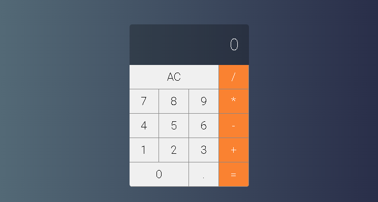

## CalculadoraReact
> Calculadora simples feita em React, inspirada na calculadora padrão do macOS.



### Instalação

Basta clonar o repositório:

```sh
git clone https://github.com/caiomdev/CalculadoraReact
```

### Configuração

Para utilizar, basta acesssar o diretório do repositório, instalar todas as dependências do React e executar:
```sh
cd CalculadoraReact
npm install
npm start
```

Depois de executar o **npm start**, a aplicação abrirá automaticamente em [http://localhost:3000/](http://localhost:3000/).
